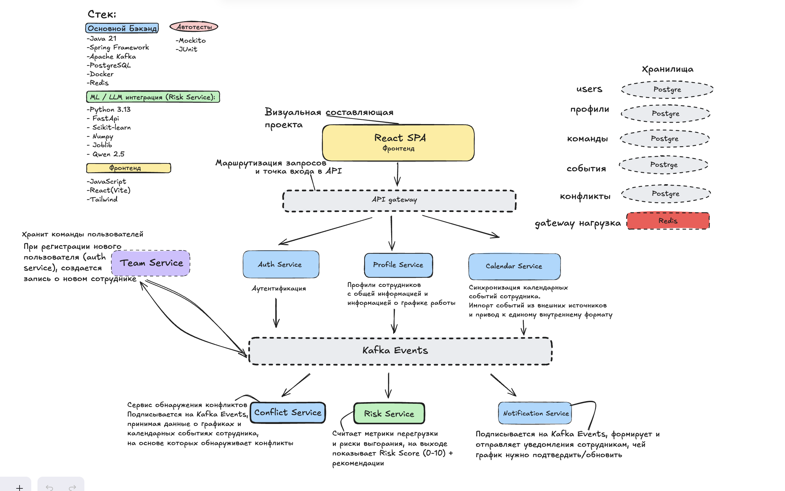

# lessmade

> Building distributed backend systems with Java & Spring.

## Tech Stack

---

# 🚀 Highlight Project

## WorkTime Sync

Distributed event-driven workforce management platform built during the **RTU MIREA "Spring Code" Hackathon**.

### Architecture

  

### My Contribution

| Service | Responsibility |
|----------|----------------|
| ⚔️ Conflict Service | Detects schedule conflicts from Kafka events |
| 👤 Profile Service | Manages employee profiles and publishes domain events |
| 📅 Calendar(Task) Service | Imports and synchronizes calendar events |

### My Stack In Project

